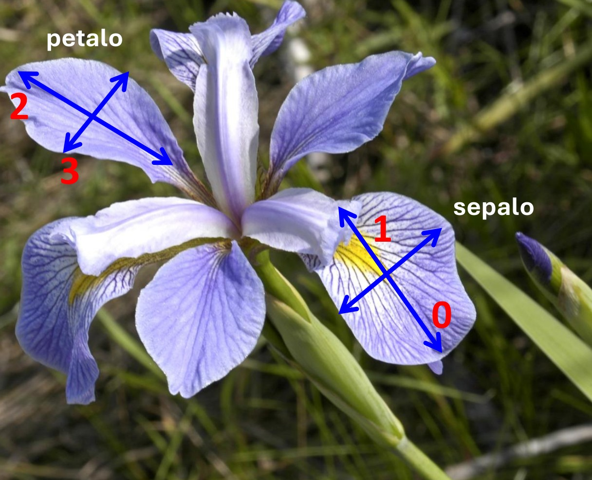
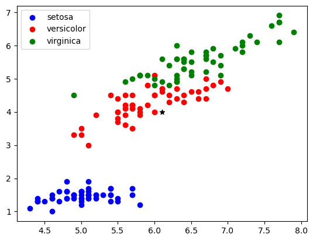

# Esercizio per il fine settimana

Descrivere una invocazione della funzione `merge_sort` che ordina una lista di stringhe per lunghezze crescenti; a parità di lunghezza, in ordine lessicografico.

*Soluzione*


```python
def merge_sort(L, key=lambda x:x, lx=0, rx=None):
    """
    Parametro: L, una lista di elementi confrontabili con <=
        lx < rx, due indici in L
    Ritorna: None

    Effetto collaterale: ordina gli elementi di L dalla posizione lx a rx-1;
    
    se rx è None, ordina fino all'ultimo elemento della lista
    """

    def merge(L, lx, cx, rx):
        """
        Parametri: L una lista di elementi confrontabili con <=
            lx <= cx < rx, tre indici di L e tali che
            L[lx] <= L[lx+1] <= ... <= L[cx-1] e
            L[cx] <= L[cx+1] <= ... <= L[rx-1]
        Output: None

        Effetto collaterale: al termine della funzione
        L[lx] <= L[lx+1] <= ... <= L[rx-1]
        """

        M = []

        i, j = lx, cx

        while i < cx and j < rx:
            if key(L[i]) <= key(L[j]):
                m = L[i]
                i += 1
            else:
                m = L[j]
                j += 1
            M.append(m)

        while i < cx:
            M.append(L[i])
            i += 1

        while j < rx:
            M.append(L[j])
            j += 1

        for i in range(len(M)):
            L[lx+i] = M[i]

        # complessità temporale O(rx-lx), nel caso peggiore O( len(L) )
        # complessità spaziale O(rx-lx), nel caso peggiore O( len(L) )

    if rx == None:
        rx = len(L)

    if lx >= rx-1:
        return None
    cx = (lx+rx)//2 # divisione intera

    merge_sort(L, key, lx, cx)
    merge_sort(L, key, cx, rx)
    merge(L, lx, cx, rx)

    # n = len(L)
    # complessità temporale: O(n log n), sempre
    # complessità spaziale: O(n) per la lista in merge + O(log n) per lo stack delle chiamate. In totale O(n)

a = ["zero", "uno", "due", "tre", "quattro", "cinque"]

merge_sort(a, key=lambda x: (len(x), x) )

print(a)
```

    ['due', 'tre', 'uno', 'zero', 'cinque', 'quattro']
    

# Funzione `sorted` e metodo `sort`

La funzione `sort` ordina una sequenza ritornando una nuova lista ordinata. Il parametro `key` ha lo stesso significato di quello in `merge_sort`.


```python
a = ["zero", "uno", "due", "tre", "quattro", "cinque"]
b = sorted(a, key=lambda x: (len(x), x))
print(a)
print(b)
```

    ['zero', 'uno', 'due', 'tre', 'quattro', 'cinque']
    ['due', 'tre', 'uno', 'zero', 'cinque', 'quattro']
    

Il metodo `sort` delle liste ordina in loco.


```python
a.sort(key=lambda x: (len(x), x))
print(a)
```

    ['due', 'tre', 'uno', 'zero', 'cinque', 'quattro']
    

Implementano una variante dell'algoritmo Merge-Sort, stesse complessità.

# Classificazione



Il dataset `Iris` raccoglie misure di sepali e petali di tre diverse specie di fiori. L'obiettivo è utilizzare queste *caratteristiche* per costruire un algoritmo capace di prevedere a quale specie appartiene un fiore: ovvero l'algoritmo, usando le caratteristiche dei fiori classificati, assegnerà una *etichetta* corrispondente alla specie ad un campione di cui conosciamo soltanto le caratteristiche.

Il file `iris.csv` contiene la descrizione di 150 fiori del genere Iris attraverso quattro caratteristiche numeriche (lunghezza e larghezza di sepali e petali) e la specie (setosa, versicolo, e virginica). Ogni riga del file contiene una stringa che raccoglie queste caratteristiche separate da virgola, ad esempio

```
4.9,3.0,1.4,0.2,Iris-setosa
```

Useremo il metodo delle stringhe `split` per separare i valori di ciascuna riga e ottenere singolarmente le caratteristiche numeriche e la specie. Il metodo `split` divide una stringa in più parti usando un separatore specificato, ritorna la lista delle parti. Ecco un esempio


```python
a = "4.9,3.0,1.4,0.2,Iris-setosa"
L = a.split(",")
print(L)
```

    ['4.9', '3.0', '1.4', '0.2', 'Iris-setosa']
    

Analizziamo il file assumendo che sia salvato nella stessa cartella del codice. Si usa la funzione `open` che ritorna una struttura dati che possiamo usare per iterare sulle righe del file.


```python
f = open("iris.csv")
X = []
for line in f:
    X.append(line.split(','))
```

Ora `X` è della forma

```python
X = [
        ["5.1", "3.5", "1.4", "0.2", "Iris-setosa",
        ["4.9", "3.0", "1.4", "0.2", "Iris-setosa",
        ...
        ["5.6", "2.9", "3.6", "1.3", "Iris-versicolor"],
        ...
        ["6.5", "3.0", "5.2", "2.0", "Iris-virginica"],
        ...
]

```

Il prossimo passaggio crea una lista con soltato le sole etichette. La lista è creata con *list comprehension*. Questo è un metodo compatto che permette di creare liste a partire da elementi di un sequenza applicando una espressione o un filtro.

La sintassi è

```python
[espressione for elemento in sequenza if condizione]
```

`espressione` e `condizione` dipendono da `elemento`: costruisce una lisa dove, se vale `condizione`, al posto di  `elemento` compare `espressione`.

Esempio: crea la lista contenente i quadrati degli elementi nell lista `b` maggiori di 5. 


```python
b = [3,1,7,8,9,3]
a = [x**2 for x in b if x > 5]
print(a)
```

    [49, 64, 81]
    

`condizione` è facoltativa


```python
b = [3,1,7,8,9,3]
a = [x**2 for x in b]
print(a)
```

    [9, 1, 49, 64, 81, 9]
    

Quindi


```python
y = [t[-1] for t in X] # list comprehension
```

è qualcosa del tipo

```python
y = ["Iris-Setosa\n",
    ...
    "Iris-Versicolor\n",
    ...
]
```

Le stringhe terminano con `\n` che è una  *sequenza escape* che rappresenta il carattere *new-line*. Con il prossimo codice lo eliminiamo


```python
y = [t[:-1] for t in y]
```

Il prossimo passaggio sostituisce le etichette in `y` con valori numerici: 0,1 e 2 per le tre etichette. Si usa una espressione condizionale che assume un valore o un altro in base al valore di un valore di verita. Ad esempio


```python
x = "13"
a = 1 if len(x) == 2 else 0
```

Il valore di `a` è 1 se la lunghezza di `x` è 2, altrimenti è 0.

Nel prossimo frammento di codice i valori della lista sono definiti con una catena di due espressioni condizionali.


```python
y = [0 if t == "Iris-setosa" else 1 if t == "Iris-versicolor" else 2 for t in y]
        # list comprehension con espressione condizionale
```

Vogliamo realizzare una nuova versione di `X` che contiene soltanto i dati numerici, eliminado le informazioni che abbiamo raccolto in `y`.

Per farlo iteriamo su `X` e, per ogni elemento, raccogliamo i primi 4 valori in una nuova lista e ignoriamo il quinto. Con

```python
for *x, _ in X:
    # fai qualcosa con x
```

l'unpacking assegna l'ultimo valore di ogni elementi in `X` alla variabile `_`, mentre i precedenti vengono impacchettati nella  lista `x`. Ad esempio


```python
*lst, var = (4,1,2,7,6,0)
print(lst)
print(var)
```

    [4, 1, 2, 7, 6]
    0
    


```python
X = [ [ float(e) for  e in x ] for *x, _ in X  ] # doppio list comprehension con
        # spacchettamento, x sarà una lista di dimensione colonne di X-1
```

Ora `X` è della forma

```python
X = [[5.1, 3.5, 1.4, 0.2],
    ...
    [4.8, 3.0, 1.4, 0.1],
    ...
    [5.9, 3.0, 5.1, 1.8]
]
```

Ricapitolando: per ogni campione, `X` contiene una lista con le sue quattro caratteristiche numeriche, mentre nella stessa posizione in `y` è memorizzata la sua etichetta numerica. Possiamo identificare ciascun campione tramite un indice `i` in `X`: `X[i]` è la sua lista di caratteristiche e `y[i]` la relativa etichetta.

Il nostro obiettivo è costruire un algoritmo che, dato un insieme di campioni classificati — ciascuno descritto da un vettore di caratteristiche e da una relativa etichetta — sia in grado di assegnare una classe a un nuovo campione di cui conosciamo solo le caratteristiche. Per simulare questa situazione, preleviamo un campione a caso dal dataset: ne estraiamo le caratteristiche e l'etichetta, quindi lo rimuoviamo da `X` e `y`, in modo da usarlo come esempio "sconosciuto" da classificare senza che influisca sull’insieme di dati rimanenti.


```python
import random
p = random.randint(0, len(X)-1)
input_sample, input_label = X[p], y[p]
del(X[p])
del(y[p])
print(input_sample, input_label)
```

    [5.6, 2.9, 3.6, 1.3] 1
    

Quindi `input_sample` è la lista delle caratteristiche del campione che vogliamo classificare automaticamente, mentre `input_label` è la sua vera etichetta che confronteremo con l'output dell'algoritmo.

Per scegliere il campione abbiamo usato la funzione `randint` della libreria `random` che ritorna un numero intero casuale all'interno dell'intervallo chiuso (gli estremi possono essere ritornati) descritto dai due valori in input.

## k-Nearest Neighbor (kNN)

È un algoritmo di classificazione che assegna a un nuovo campione la classe più frequente tra i k campioni del dataset che gli sono più vicini.
La vicinanza è misurata tramite una distanza (di solito Euclidea) tra i vettori delle caratteristiche.



L'immagine mostra i punti del dataset quadridimensionale proiettati su due dimensioni (lunghezza del sepalo e del petalo). Il campione da classificare, rappresentato dalla stella nera, verrebbe assegnato alla classe "versicolor" dall'algoritmo kNN con `k = 5`.


```python
def kNN(F, labels, input_sample, k=5):
    """
    Parametri: F: una lista di tuple tutte della stessa dimensione (d) e a valori float.
                X[i] sono i valori delle features del campione i
            labels: una lista di etichette di tipo intero, labels[i] è l'etichetta del campione i descritto da F[i] deve essere len(X) == len(labels)
            input_sample: una tupla di feature di dimensione d
            k: un intero
    Ritorna un intero: l'etichetta predetta per input_sample
        None, se c'e un errore nei parametri
    """

    n, d = len(F), len(input_sample)

    # verifica dimensione di F
    if len(labels) != n:
        return None
    # verifica dimensioni di F[i]
    if any( [len(f) != d for f in F] ):
        #return [len(f) for f in F]
        return None
    
    # lista delle distanze di x da ogni campione + etichetta del campione
    distanze = [ (eucdist(f, input_sample), lab) for f, lab in zip(F, labels) ]

    k_nearest = sorted(distanze, key=lambda z: z[0])[:k]

    labels_in_nn = [lab for _, lab in k_nearest]

    return moda(labels_in_nn)

```

Le variabili `n` e `d` rappresentano rispettivamente il numero di campioni e di caratteristiche.

Nelle righe da 14 e 20 vengono eseguiti alcuni controlli sui parametri. Il secondo `if` verifica che ogni elemento in `F` abbia dimensione `d`, se questo non succede la funzione termina restituendo `None`. Viene utilizzata la funzione `any` che prende in input una sequenza di booleani e ritorna `True` se almeno uno di questi vale `True`, altrimenti restituisce `False`. Esiste anche la funzione `all` che restituisce `True` se e solo se tutti i valori nella sequenza sono `True`.

Questa riga di codice crea una lista di distanze tra il campione da classificare e tutti i campioni del dataset.

* `zip(F, labels)` accoppia ogni lista di caratteristiche `f` con la sua etichetta `lab`.

* `eucdist(f, input_sample)` calcola la distanza euclidea tra il campione `f` e `input_sample`.

La list comprehension costruisce una lista di tuple (distanza, etichetta) per tutti i campioni in `F`.

In altre parole, dopo questa riga, `distanze` contiene tutte le distanze dal campione da classificare insieme alle rispettive etichette, pronte per identificare i vicini più prossimi.

Esempio di utilizzo di `zip`:


```python
a = ["zero", "uno", "due"]
b = [0,1,2]
c = [9,3,4]

for x0,x1,x2 in zip(a,b,c):
    print(x0, x1, x2)

```

    zero 0 9
    uno 1 3
    due 2 4
    

La riga successiva seleziona i `k` campioni più vicini al campione da classificare:

- `sorted(distanze, key=lambda z: z[0])` ordina la lista di tuple `(distanza, etichetta)` in ordine crescente di distanza (primo elemento della coppia).
- `[:k]` esegue uno slicing per selezionare solo i primi `k` elementi della lista ordinata.

La linea 27 raccoglie tutte le etichette del vicinato in una lista che sarà usata dalla funzione `moda` che restituirà il valore più frequente.

Le funzioni `eucdist` e `moda` sono implementate separatamente, ecco il loro codice:


```python
def eucdist(v, u):
    """
    Parametri: u, v due liste contenenti gli elementi di due vettori della stessa dimensione
    Ritorna: la distanza euclidea tra u e v
    """
    
    return (sum((x - y) ** 2 for x, y in zip(u, v)))**0.5
```

La funzione somma i quadrati delle differenze tra gli elementi corrispondenti dei due vettori e poi ne calcola la radice quadrata, restituendo così la distanza euclidea. Vediamo quello che succede con un esempio scomponendo la riga dentro la funzione


```python
u = (1,3,2)
v = (2,1,1)

somme_quadrati = [(x - y) ** 2 for x, y in zip(u, v)]
print(somme_quadrati)
print(sum(somme_quadrati)**0.5)
```

    [1, 4, 1]
    2.449489742783178
    

Nell'esempio, la funzione `sum` ritorna la somma degli elementi della lista, tuttavia la stessa funzione può essere invocata con definendo un parametro per ogni elemento da sommare. Cosa che accade nel codice della funzoone `eucdist`.

Passiamo alla funzione `moda`.


```python
def moda(L):
    """
    Parametri: L, una lista di interi positivi
    Ritorna l'elemento più frequente in L
    """

    max_val = max(L)

    occorrenze = [0]*(max_val+1)

    for x in L:
        occorrenze[x] += 1

    return argmax(occorrenze)
```

La funzione utilizza la lista `occorrenze` contenente tanti elementi quante sono le possibili etichette. Tenendo in mente che le etichette sono di tipo intero, le etichette corrispondono ad indici in `occorrenze`. Quindi `occorrenze[e]` conterrà il numero di volte in cui `e` compare il `L`. L'etichetta più frequente è data dalla posizione del massimo in `occorrenze`. Questo valore è ritornato da `argmax(occorrenze)`. 


```python
def argmax(L):
    """
    Parametri: una lista di numeri
    Ritorna la posizione del massimo
    """

    return max(enumerate(L), key=lambda t: t[1])[0]
```

Per ritornare la posizione del massimo, per ogni elemento in `L`, consideriamo la lista composta da `(posizione, valore)` degli elementi in `L`; massimizziamo rispetto al secondo componente della coppia e ritorniamo il primo.

La soluzione utilizza il parametro `key` della funzione `max` che ha lo stesso utilizzo dell'omonimo parametro nelle funzioni e metodi di ordinamento.

Esempio di utilizzo di `kNN`:


```python
print(kNN(X, y, input_sample))
```

    1
    

In questo caso l'output corrisponde alla reale etichetta di `input_sample`.
